# Fix Plan: Supabase Database Import/Export Mismatch

## Problem Statement

The build fails with: `src/services/supabase/db.ts does not provide an export named 'fetchApplicationsFromDb'`

Despite the export **existing** at line 623 of `db.ts`, the build pipeline (`tsc -b && vite build`) fails to resolve it.

## Root Cause Analysis

The root cause is a **combination of three interacting issues**:

### 1. `@ts-nocheck` masking TypeScript errors in `db.ts`

The `// @ts-nocheck` directive at the top of [`db.ts`](src/services/supabase/db.ts:1) suppresses ALL TypeScript diagnostics. This prevents TypeScript from properly validating the module's export signatures during `tsc -b`. While `@ts-nocheck` suppresses error *reporting*, it can interfere with how TypeScript resolves and validates the module's export graph — especially under strict settings.

### 2. `verbatimModuleSyntax: true` in tsconfig

[`tsconfig.app.json`](tsconfig.app.json:13) enables `verbatimModuleSyntax`, which strictly requires:
- `import type { ... }` for type-only imports
- `import { ... }` for value imports only

When `db.ts` has `@ts-nocheck`, TypeScript skips validating whether its imports comply with `verbatimModuleSyntax`. This creates a **module resolution gap** — the consuming files expect properly validated exports, but the source module was never properly checked.

### 3. Missing return types on Section 2 functions

The "FromDb/InDb" style functions in `db.ts` (lines 608–757) lack explicit return type annotations:

| Function | Line | Has Return Type? | Has try/catch? |
|---|---|---|---|
| `updateApplicationStatusInDb` | 608 | ❌ No | ❌ No — throws raw |
| `fetchApplicationsFromDb` | 623 | ❌ No | ✅ Delegates to typed funcs |
| `fetchSavedJobsFromDb` | 630 | ❌ No | ❌ No — throws raw |
| `saveJobToDb` | 642 | ❌ No | ❌ No — throws raw |
| `unsaveJobFromDb` | 655 | ❌ No | ❌ No — throws raw |
| `fetchMessagesFromDb` | 668 | ❌ No | ❌ No — throws raw |
| `sendMessageToDb` | 681 | ❌ No | ❌ No — throws raw |
| `fetchReviewsFromDb` | 695 | ❌ No | ❌ No — throws raw |
| `submitReviewToDb` | 707 | ❌ No | ❌ No — throws raw |
| `fetchNotificationsFromDb` | 721 | ❌ No | ❌ No — throws raw |
| `markNotificationReadInDb` | 734 | ❌ No | ❌ No — throws raw |
| `createNotificationInDb` | 745 | ❌ No | ❌ No — throws raw |

Without explicit return types, TypeScript cannot properly infer the module's export signatures under strict mode, contributing to the resolution failure.

### 4. `@ts-nocheck` on consuming store files

Multiple store files also have `@ts-nocheck`, which masks import resolution errors on the consumer side:

| Store File | Has `@ts-nocheck`? | Imports from `db.ts` |
|---|---|---|
| `useAppliedJobs.ts` | ✅ Yes | `fetchApplicationsFromDb` |
| `useApplications.ts` | ✅ Yes | Section 1 application funcs |
| `useSavedJobsStore.ts` | ✅ Yes | Section 1 saved job funcs |
| `useNotificationsStore.ts` | ✅ Yes | Section 1 notification funcs |
| `useReviewsStore.ts` | ✅ Yes | Section 1 review funcs |

## Complete Import/Export Map

```mermaid
graph LR
    subgraph db.ts Section 1 - Well Typed
        A1[fetchAllJobs]
        A2[fetchProviderJobs]
        A3[fetchJobById]
        A4[createJob]
        A5[updateJob]
        A6[deleteJob]
        B1[fetchStudentApplications]
        B2[fetchProviderApplications]
        B3[submitApplication]
        B4[updateApplicationStatus]
        B5[checkApplicationExists]
        C1[fetchSavedJobs]
        C2[saveJob]
        C3[unsaveJob]
        C4[isJobSaved]
        D1[fetchConversation]
        D2[fetchConversations]
        D3[sendMessage]
        D4[markMessageAsRead]
        E1[fetchNotifications]
        E2[createNotification]
        E3[markNotificationAsRead]
        E4[deleteNotification]
        F1[fetchUserReviews]
        F2[submitReview]
        F3[calculateAverageRating]
    end

    subgraph db.ts Section 2 - FromDb/InDb - Untyped
        G1[fetchApplicationsFromDb]
        G2[fetchSavedJobsFromDb]
        G3[saveJobToDb]
        G4[unsaveJobFromDb]
        G5[fetchMessagesFromDb]
        G6[sendMessageToDb]
        G7[fetchReviewsFromDb]
        G8[submitReviewToDb]
        G9[fetchNotificationsFromDb]
        G10[markNotificationReadInDb]
        G11[createNotificationInDb]
        G12[updateApplicationStatusInDb]
    end

    subgraph Consumers
        S1[useJobs.ts]
        S2[useApplications.ts]
        S3[useSavedJobsStore.ts]
        S4[useMessagesStore.ts]
        S5[useNotificationsStore.ts]
        S6[useReviewsStore.ts]
        S7[useAppliedJobs.ts]
        S8[useSavedJobs.ts]
        S9[useNotifications.ts]
    end

    A1 --> S1
    A2 --> S1
    A3 --> S1
    B1 --> S2
    B2 --> S2
    B3 --> S2
    B4 --> S2
    B5 --> S2
    C1 --> S3
    C2 --> S3
    C3 --> S3
    C4 --> S3
    D1 --> S4
    D2 --> S4
    D3 --> S4
    D4 --> S4
    E1 --> S5
    E2 --> S5
    E3 --> S5
    E4 --> S5
    F1 --> S6
    F2 --> S6
    F3 --> S6
    G1 --> S7
    G2 --> S8
    G3 --> S8
    G4 --> S8
    G5 --> S9
    G9 --> S9
    G10 --> S9
    G11 --> S9
```

## Fix Strategy

### Phase 1: Fix `db.ts` — the source module

**Goal:** Make all exports properly typed and resolvable by TypeScript under strict `verbatimModuleSyntax`.

1. **Remove `@ts-nocheck`** from [`db.ts`](src/services/supabase/db.ts:1)
2. **Add explicit return type annotations** to all Section 2 functions:
   - `updateApplicationStatusInDb` → `Promise<Application | null>`
   - `fetchApplicationsFromDb` → `Promise<Application[]>`
   - `fetchSavedJobsFromDb` → `Promise<any[]>` (uses `select('*, job_id(*)')` join)
   - `saveJobToDb` → `Promise<any | null>`
   - `unsaveJobFromDb` → `Promise<void>`
   - `fetchMessagesFromDb` → `Promise<any[]>`
   - `sendMessageToDb` → `Promise<any | null>`
   - `fetchReviewsFromDb` → `Promise<any[]>`
   - `submitReviewToDb` → `Promise<any | null>`
   - `fetchNotificationsFromDb` → `Promise<any[]>`
   - `markNotificationReadInDb` → `Promise<void>`
   - `createNotificationInDb` → `Promise<any | null>`
3. **Add try/catch error handling** to Section 2 functions that currently throw raw errors, matching the graceful fallback pattern from Section 1:
   - `updateApplicationStatusInDb` — return `null` on error
   - `fetchSavedJobsFromDb` — return `[]` on error
   - `saveJobToDb` — return `null` on error
   - `unsaveJobFromDb` — return void, log error
   - `fetchMessagesFromDb` — return `[]` on error
   - `sendMessageToDb` — return `null` on error
   - `fetchReviewsFromDb` — return `[]` on error
   - `submitReviewToDb` — return `null` on error
   - `fetchNotificationsFromDb` — return `[]` on error
   - `markNotificationReadInDb` — return void, log error
   - `createNotificationInDb` — return `null` on error
4. **Verify all imports in `db.ts` comply with `verbatimModuleSyntax`**:
   - `import { supabase, isSupabaseConfigured } from './supabaseClient'` — ✅ value import, OK
   - `import type { Job, ... } from '@/types/database'` — ✅ type import, OK

### Phase 2: Fix consuming store files

**Goal:** Remove `@ts-nocheck` and ensure all imports are properly resolved.

1. **[`useAppliedJobs.ts`](src/store/useAppliedJobs.ts:1)** — Remove `@ts-nocheck`, verify `fetchApplicationsFromDb` import resolves
2. **[`useApplications.ts`](src/store/useApplications.ts:1)** — Remove `@ts-nocheck`, verify Section 1 application imports resolve
3. **[`useSavedJobsStore.ts`](src/store/useSavedJobsStore.ts:1)** — Remove `@ts-nocheck`, verify Section 1 saved job imports resolve
4. **[`useNotificationsStore.ts`](src/store/useNotificationsStore.ts:1)** — Remove `@ts-nocheck`, verify Section 1 notification imports resolve
5. **[`useReviewsStore.ts`](src/store/useReviewsStore.ts:1)** — Remove `@ts-nocheck`, verify Section 1 review imports resolve
6. **Verify `import type` usage** in all store files complies with `verbatimModuleSyntax`

### Phase 3: Validate build and runtime

1. Run `npm run build` — confirm `tsc -b && vite build` succeeds with zero errors
2. Run `npm run dev` — confirm localhost dev server starts and loads correctly
3. Verify dashboard behavior is preserved — applied jobs, saved jobs, notifications, reviews all work
4. Verify Render deployment compatibility — `render.yaml` and build config unchanged

## What NOT to Change

- ❌ Do NOT rewrite the entire database layer
- ❌ Do NOT remove existing functionality
- ❌ Do NOT change `verbatimModuleSyntax` setting (it's correct, the code should comply)
- ❌ Do NOT modify `vite.config.ts` or `render.yaml`
- ❌ Do NOT alter the Zustand store structure or state interfaces
- ❌ Do NOT change the Supabase client configuration
- ❌ Do NOT remove Section 1 well-typed functions
- ❌ Do NOT break the `useSavedJobs.ts` / `useNotifications.ts` stores that use Section 2 functions correctly

## Risk Assessment

- **Low risk:** Adding return types and try/catch to Section 2 functions — purely additive, no behavior change for successful paths
- **Low risk:** Removing `@ts-nocheck` from store files — may surface hidden type errors that need fixing, but these are minor
- **Medium risk:** Removing `@ts-nocheck` from `db.ts` — may surface type errors in the Supabase query chain, but these can be fixed with proper typing
- **No risk:** Build validation — just running the build command to confirm success