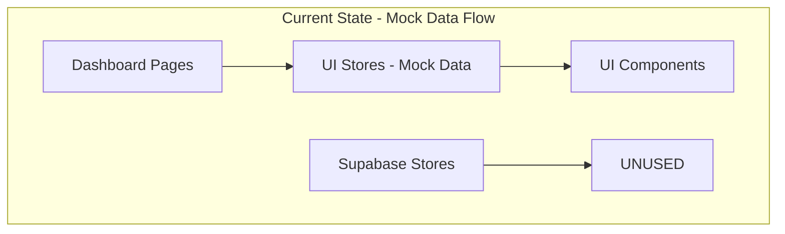
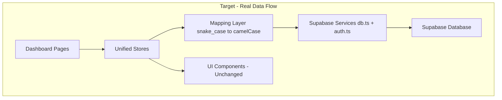
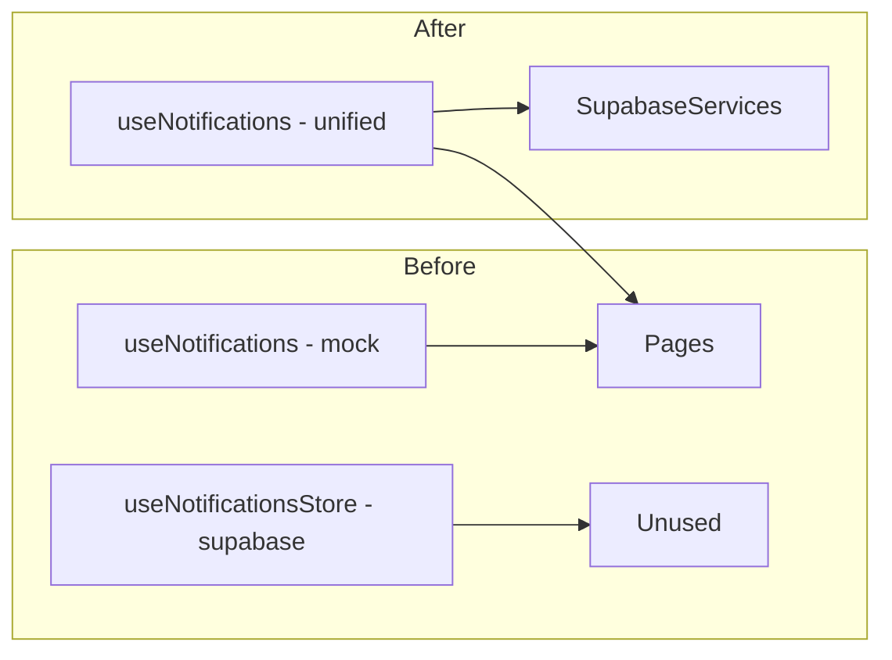
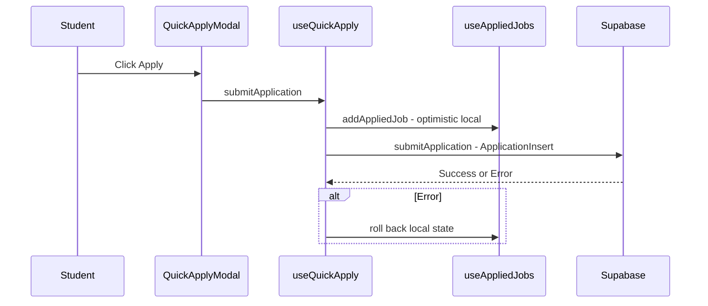
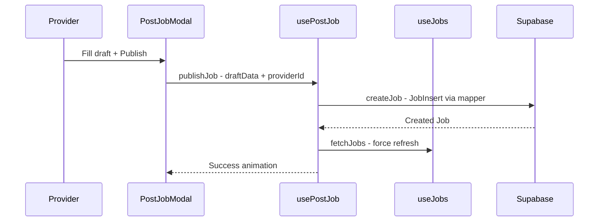

# Supabase Frontend Integration Plan

## Overview

Connect the Zivaro frontend to real Supabase database tables, replacing mock/hardcoded data with persistent, production-ready data architecture while preserving all existing UI/UX.

---

## Current State Analysis

### Problem: Dual-Store Architecture

The codebase has **two stores per domain** — one UI-facing with mock data and camelCase types, one Supabase-connected with snake_case database types. Pages consume the mock stores exclusively.



| Domain | UI Store - Used by Pages | Supabase Store - Unused | Mock Data Source |
|--------|--------------------------|-------------------------|------------------|
| Jobs | `useJobs.ts` | — | `MOCK_JOBS` in DashboardPage |
| Applications | `useAppliedJobs.ts` | `useApplications.ts` | `MOCK_APPLICATIONS` in JobsPage |
| Saved Jobs | `useSavedJobs.ts` | `useSavedJobsStore.ts` | localStorage + partial Supabase |
| Notifications | `useNotifications.ts` | `useNotificationsStore.ts` | `INITIAL_NOTIFICATIONS` hardcoded |
| Reviews | `useReviews.ts` | `useReviewsStore.ts` | `SEED_REVIEWS` hardcoded |
| Auth | `useAuth.ts` | — | Already connected to Supabase |

### Problem: Type Mismatch

[`JobCard.tsx`](src/components/dashboard/JobCard.tsx:10) defines `Job` with **camelCase** fields while [`database.ts`](src/types/database.ts:28) defines `Job` with **snake_case** fields. No mapper exists.

| JobCard Job field | database.ts Job field |
|---|---|
| `businessName` | `business_name` |
| `payoutType` | `payout_type` |
| `isUrgent` | `is_urgent` |
| `isPremium` | `is_premium` |
| `isVerified` | `is_verified` |
| `logoPlaceholder` | `logo_placeholder` |
| `postedTime` | `posted_time` |

### Problem: TypeScript Suppression

`@ts-nocheck` on critical files masks real errors and prevents proper export resolution:

- [`supabaseClient.ts`](src/services/supabase/supabaseClient.ts:1)
- [`auth.ts`](src/services/supabase/auth.ts:1)
- [`db.ts`](src/services/supabase/db.ts:1)
- [`useAppliedJobs.ts`](src/store/useAppliedJobs.ts:1)
- [`useApplications.ts`](src/store/useApplications.ts:1)
- [`useNotificationsStore.ts`](src/store/useNotificationsStore.ts:1)

### Problem: Untyped Section 2 Functions

Lines 608-757 in [`db.ts`](src/services/supabase/db.ts:608) lack return types and try/catch error handling.

### Problem: Simulated Flows

- [`PostJobModal.tsx`](src/components/dashboard/provider/PostJobModal.tsx:28) uses `setTimeout` instead of `createJob`
- [`useQuickApply.ts`](src/store/useQuickApply.ts:22) only calls local `addAppliedJob`, never Supabase

---

## Target Architecture



### Data Flow Principle

**Pages → Unified Store → Mapper → Supabase Service → Database**

- Stores hold **camelCase UI objects** for component consumption
- Mappers convert **snake_case DB rows → camelCase UI objects**
- Services return **snake_case DB rows** from Supabase
- Components remain **unchanged** — they still receive camelCase data

---

## Phase 1: Foundation — TypeScript Cleanup

**Goal**: Remove `@ts-nocheck`, fix all TypeScript errors, add proper types to untyped functions.

### Steps

1. **Remove `@ts-nocheck` from all files**:
   - [`supabaseClient.ts`](src/services/supabase/supabaseClient.ts:1) — fix `any` type on `onAuthStateChange` callback
   - [`auth.ts`](src/services/supabase/auth.ts:1) — fix `SupabaseProfile` extends pattern
   - [`db.ts`](src/services/supabase/db.ts:1) — fix all import type vs value issues per `verbatimModuleSyntax`
   - [`useAppliedJobs.ts`](src/store/useAppliedJobs.ts:1) — fix `any` row type in `loadAppliedJobs`
   - [`useApplications.ts`](src/store/useApplications.ts:1) — fix type annotations
   - [`useNotificationsStore.ts`](src/store/useNotificationsStore.ts:1) — fix type annotations

2. **Add return types and try/catch to db.ts Section 2 functions**:
   - `updateApplicationStatusInDb` → add `Promise<Application | null>` return type + try/catch
   - `fetchApplicationsFromDb` → add `Promise<Application[]>` return type
   - `fetchSavedJobsFromDb` → add `Promise<SavedJob[]>` return type + try/catch
   - `saveJobToDb` → add `Promise<SavedJob | null>` return type + try/catch
   - `unsaveJobFromDb` → add `Promise<boolean>` return type + try/catch
   - `fetchMessagesFromDb` → add `Promise<Message[]>` return type + try/catch
   - `sendMessageToDb` → add `Promise<Message | null>` return type + try/catch
   - `fetchReviewsFromDb` → add `Promise<Review[]>` return type + try/catch
   - `submitReviewToDb` → add `Promise<Review | null>` return type + try/catch
   - `fetchNotificationsFromDb` → add `Promise<Notification[]>` return type + try/catch
   - `markNotificationReadInDb` → add `Promise<boolean>` return type + try/catch
   - `createNotificationInDb` → add `Promise<Notification | null>` return type + try/catch

3. **Fix `verbatimModuleSyntax` compliance** across all files — ensure `import type` for type-only imports

4. **Verify build passes** with `tsc -b && vite build`

---

## Phase 2: Data Mapping Layer

**Goal**: Create snake_case → camelCase mappers so DB rows become UI-compatible objects.

### New File: `src/utils/dataMappers.ts`

This file will contain pure, testable mapper functions for each domain:

```
src/utils/dataMappers.ts
├── mapDbJobToUiJob(dbJob: Job) → JobCard.Job
├── mapDbApplicationToUiApplication(dbApp: Application) → AppliedJobRecord
├── mapDbSavedJobToUiSavedJob(dbSavedJob: SavedJob) → saved jobs entry
├── mapDbNotificationToUiNotification(dbNotif: Notification) → NotificationItem
├── mapDbReviewToUiReview(dbReview: Review) → useReviews.Review
├── mapUiJobToDbJob(uiJob: JobCard.Job) → JobInsert  (for createJob)
├── mapUiJobDraftToDbJob(draft: JobDraftData, providerId: string) → JobInsert
└── mapDbProfileToUiSession(profile: Profile) → UserSession fields
```

### Key Mapping Rules

| DB snake_case | UI camelCase | Notes |
|---|---|---|
| `business_name` | `businessName` | Direct rename |
| `payout_type` | `payoutType` | Direct rename |
| `is_urgent` | `isUrgent` | Direct rename |
| `is_premium` | `isPremium` | Direct rename |
| `is_verified` | `isVerified` | Direct rename |
| `logo_placeholder` | `logoPlaceholder` | Direct rename |
| `posted_time` | `postedTime` | Direct rename |
| `null` tags | `[]` empty array | Null-safe default |
| `null` optional fields | `undefined` or empty string | Null-safe default |
| — | `isNearby` | Derived from distance field or tags |

### Also Update: `src/types/database.ts`

Add a `UiJob` type alias that matches the `JobCard.Job` interface, so mappers have explicit target types:

```typescript
// UI-facing job type matching JobCard.Job
export type UiJob = {
  id: string
  title: string
  businessName: string
  description: string
  payout: number
  payoutType: 'hr' | 'shift' | 'task' | 'month'
  isUrgent: boolean
  isPremium: boolean
  isNearby?: boolean
  isVerified?: boolean
  location: string
  distance: string
  timing: string
  postedTime: string
  tags: string[]
  logoPlaceholder: string
}
```

---

## Phase 3: Store Consolidation

**Goal**: Merge duplicate stores. Each domain gets ONE unified store that maintains the existing UI interface but calls Supabase behind the scenes.

### Strategy



### 3.1: `useJobs.ts` — Already partially connected

**Current**: Calls `fetchAllJobs`, `fetchProviderJobs`, `fetchJobById` from db.ts but returns snake_case `Job` objects.

**Changes needed**:
- Add `mapDbJobToUiJob` mapper in `fetchJobs` and `fetchProviderJobs`
- Store `UiJob[]` instead of `Job[]`
- Add `createJob` action that maps `JobDraftData` → `JobInsert` and calls `createJob` from db.ts
- Add `deleteJob` action
- Add `refreshJobs` for manual refresh

### 3.2: `useAppliedJobs.ts` → Merge with `useApplications.ts`

**Current**: `useAppliedJobs` is a simple `Record<string, AppliedJobRecord>` with local-only `addAppliedJob`. `useApplications` has full Supabase integration but is unused.

**Changes needed**:
- Enhance `useAppliedJobs` to call Supabase on `addAppliedJob`
- Add `loadAppliedJobs` that fetches from `fetchApplicationsFromDb` and maps results
- Add `updateApplicationStatus` action
- Remove `useApplications.ts` after migration is verified

### 3.3: `useSavedJobs.ts` → Merge with `useSavedJobsStore.ts`

**Current**: `useSavedJobs` already has partial Supabase integration via `saveJobToDb`/`unsaveJobFromDb`/`fetchSavedJobsFromDb`. It maps DB rows manually inline.

**Changes needed**:
- Replace inline mapping in `loadSavedJobs` with `mapDbSavedJobToUiSavedJob` from mappers
- Ensure `saveJob`/`unsaveJob` use proper optimistic UI pattern
- Remove `useSavedJobsStore.ts` after migration is verified

### 3.4: `useNotifications.ts` → Merge with `useNotificationsStore.ts`

**Current**: `useNotifications` has hardcoded `INITIAL_NOTIFICATIONS` and partial Supabase write integration. `useNotificationsStore` has full Supabase read/write but is unused.

**Changes needed**:
- Replace `INITIAL_NOTIFICATIONS` with dynamic `loadNotifications` that fetches from `fetchNotificationsFromDb` and maps via `mapDbNotificationToUiNotification`
- Keep the `NotificationItem` UI interface unchanged
- Add proper `markAsRead` that calls `markNotificationReadInDb` for ALL notifications not just non-mock ones
- Add `deleteNotification` that calls `deleteNotification` from db.ts
- Remove `useNotificationsStore.ts` after migration is verified

### 3.5: `useReviews.ts` → Merge with `useReviewsStore.ts`

**Current**: `useReviews` has `SEED_REVIEWS` and local-only `submitReview`. `useReviewsStore` has full Supabase but is unused.

**Changes needed**:
- Replace `SEED_REVIEWS` with dynamic `loadReviews` that fetches from `fetchReviewsFromDb` and maps via `mapDbReviewToUiReview`
- Keep the `Review` UI interface from `useReviews` unchanged — it has richer fields like `reviewerName`, `reviewerAvatar`, `jobTitle`
- Enhance `submitReview` to call `submitReviewToDb` after local state update
- Add `loadAverageRating` that calls `calculateAverageRating`
- Remove `useReviewsStore.ts` after migration is verified

### 3.6: `useQuickApply.ts` — Connect to real application submission

**Current**: Only calls `useAppliedJobs.getState().addAppliedJob(job.id)` locally.

**Changes needed**:
- After local state update, call `submitApplication` from db.ts with mapped `ApplicationInsert`
- Add error handling — if Supabase fails, roll back local state
- Pass `studentId` from `useAuth` store

### 3.7: `usePostJob.ts` + `PostJobModal.tsx` — Connect to real job creation

**Current**: `PostJobModal` uses `setTimeout` to simulate publishing.

**Changes needed**:
- Add `publishJob` action to `usePostJob` that maps `JobDraftData` → `JobInsert` via mapper and calls `createJob` from db.ts
- Replace `handlePublish` in `PostJobModal` to call `publishJob` instead of `setTimeout`
- On success, trigger `useJobs.fetchJobs(true)` to refresh the feed
- Add `isPublishing` and `publishError` state

---

## Phase 4: Page Integration — Replace Mock Data

**Goal**: Replace all hardcoded `MOCK_*` arrays with store data.

### 4.1: `DashboardPage.tsx`

**Current**: Uses `MOCK_JOBS` constant array of 6 jobs.

**Changes**:
- Import `useJobs` store
- Call `useJobs.fetchJobs()` on mount via `useEffect`
- Replace `MOCK_JOBS` with `useJobs(state => state.jobs)`
- Add loading skeleton while `isLoading` is true
- Add error fallback if `error` is set
- Keep all existing filtering logic — `urgentJobs`, `nearbyJobs`, `cafeJobs` etc. work on the array regardless of source

### 4.2: `JobsPage.tsx`

**Current**: Uses `MOCK_APPLICATIONS` with embedded mock `Job` objects.

**Changes**:
- Import `useAppliedJobs` and `useJobs` stores
- Load applications via `useAppliedJobs.loadAppliedJobs(userId, role)`
- Load jobs for cross-referencing via `useJobs`
- Build `TrackedApplication[]` from real application + job data
- Keep all existing tab filtering and animation logic

### 4.3: `ProviderDashboardPage.tsx`

**Current**: Uses `MOCK_ACTIVE_JOBS` and `MOCK_APPLICANTS`.

**Changes**:
- Import `useJobs` for provider jobs via `fetchProviderJobs(providerId)`
- Import `useAppliedJobs` for provider applications via `loadAppliedJobs(providerId, 'provider')`
- Build `ActiveJobCard` data from real jobs + application counts
- Build `ApplicantCard` data from real applications + profile lookups
- Add loading states and error fallbacks

### 4.4: `SavedJobsPage.tsx`

**Current**: Already uses `useSavedJobs` store — partially connected.

**Changes**:
- Call `useSavedJobs.loadSavedJobs(studentId)` on mount
- Ensure `unsaveJob` passes `studentId` for Supabase sync
- Add loading skeleton

### 4.5: `NotificationsPage.tsx`

**Current**: Uses `useNotifications` with hardcoded initial data.

**Changes**:
- Call `useNotifications.loadNotifications(userId, role)` on mount
- Remove simulation triggers or make them create real notifications via `createNotificationInDb`
- Add loading skeleton

### 4.6: `ProfilePage.tsx`

**Current**: Uses `useAuth` for user data, hardcoded stats, mock review subject IDs.

**Changes**:
- Load real reviews via `useReviews.loadReviews(subjectId)`
- Load real rating via `useReviews.loadAverageRating(subjectId)`
- Replace hardcoded stats with real counts from stores
- Replace `mock-provider` / `mock-student` subject IDs with real profile IDs

---

## Phase 5: Flow Integration — Real Supabase Operations

### 5.1: Application Flow



### 5.2: Job Posting Flow



### 5.3: Save/Unsave Flow

```mermaid
sequenceDiagram
    participant Student
    participant JobCard
    participant useSavedJobs
    participant Supabase

    Student->>JobCard: Click Bookmark
    JobCard->>useSavedJobs: saveJob - optimistic local
    useSavedJobs->>Supabase: saveJobToDb - studentId + jobId
    Supabase-->>useSavedJobs: Confirm or Error
    alt Error
        useSavedJobs: Roll back local state
    end
```

### 5.4: Notification Creation on Application

When a student applies, create a notification for the provider:

- In `useQuickApply.submitApplication`, after successful Supabase insert
- Call `createNotificationInDb` with `user_id = job.provider_id`, type = `new_applicant`

When a provider updates application status, create a notification for the student:

- In `useAppliedJobs.updateApplicationStatus`, after successful Supabase update
- Call `createNotificationInDb` with `user_id = application.student_id`, type = `application_viewed` or `offer_accepted`

---

## Phase 6: Data Loading Architecture

### 6.1: Centralized Init Hook — `src/hooks/useAppInit.ts`

A single hook that loads all user-specific data when auth state changes:

```typescript
export const useAppInit = () => {
  const { user, isAuthenticated, isRecovering } = useAuth()
  
  useEffect(() => {
    if (!isAuthenticated || !user || isRecovering) return
    
    // Load all user-specific data in parallel
    const init = async () => {
      await Promise.allSettled([
        useJobs.getState().fetchJobs(),
        useAppliedJobs.getState().loadAppliedJobs(user.id, user.role),
        useSavedJobs.getState().loadSavedJobs(user.id),
        useNotifications.getState().loadNotifications(user.id, user.role),
        // Reviews loaded per-profile on demand
      ])
    }
    init()
  }, [isAuthenticated, user?.id, isRecovering])
}
```

Call this hook in [`DashboardLayout.tsx`](src/components/layout/DashboardLayout.tsx) so data loads once on dashboard entry.

### 6.2: Loading Skeletons

Use existing [`LoadingSkeletons.tsx`](src/components/shared/LoadingSkeletons.tsx) components in pages while `isLoading` is true.

### 6.3: Error States

Use existing [`ErrorStates.tsx`](src/components/shared/ErrorStates.tsx) components when store `error` is set.

### 6.4: Retry Mechanism

Each store `fetch*` action should support `forceRefresh` parameter to bypass cache and retry.

---

## Phase 7: Performance and Polish

### 7.1: Prevent Excessive Rerenders

- Use `useCallback` and `useMemo` for derived data in pages
- Use Zustand selectors: `useJobs(state => state.jobs)` not `useJobs()`
- Keep store subscriptions minimal — subscribe only to needed slices

### 7.2: Optimistic UI Pattern

All mutation actions follow this pattern:

```typescript
// 1. Update local state immediately
set((state) => ({ items: [...state.items, newItem] }))
// 2. Call Supabase
try {
  const result = await supabaseMutation()
  // 3. Replace optimistic item with real item on success
  if (result) set((state) => ({ items: state.items.map(i => i.id === tempId ? result : i) }))
} catch (err) {
  // 4. Roll back on failure
  set((state) => ({ items: state.items.filter(i => i.id !== tempId) }))
  set({ error: err.message })
}
```

### 7.3: Graceful Fallbacks

- If Supabase is not configured, stores fall back to empty data with a warning
- If a fetch fails, show existing cached data + error banner
- If a mutation fails, roll back local state + show error toast

### 7.4: Cache Strategy

- Jobs: 5-minute cache via `lastFetch` timestamp — already implemented in `useJobs`
- Applications: Fetch on mount, refresh on mutation
- Saved Jobs: Fetch on mount, refresh on save/unsave
- Notifications: Fetch on mount, refresh on new notification
- Reviews: Fetch on profile page mount

---

## Files to Create

| File | Purpose |
|------|---------|
| `src/utils/dataMappers.ts` | snake_case → camelCase mapping functions |
| `src/hooks/useAppInit.ts` | Centralized data loading on auth change |

## Files to Modify

| File | Changes |
|------|---------|
| `src/services/supabase/db.ts` | Remove `@ts-nocheck`, add return types to Section 2, add try/catch |
| `src/services/supabase/auth.ts` | Remove `@ts-nocheck`, fix types |
| `src/services/supabase/supabaseClient.ts` | Remove `@ts-nocheck`, fix `any` types |
| `src/types/database.ts` | Add `UiJob` type alias |
| `src/store/useJobs.ts` | Add mapper, store UiJob[], add createJob/deleteJob actions |
| `src/store/useAppliedJobs.ts` | Remove `@ts-nocheck`, add Supabase submit + update + load |
| `src/store/useSavedJobs.ts` | Use mappers instead of inline mapping |
| `src/store/useNotifications.ts` | Replace INITIAL_NOTIFICATIONS with dynamic load, full Supabase integration |
| `src/store/useReviews.ts` | Replace SEED_REVIEWS with dynamic load, Supabase submit |
| `src/store/useQuickApply.ts` | Add real Supabase application submission |
| `src/store/usePostJob.ts` | Add publishJob action with Supabase createJob |
| `src/pages/dashboard/DashboardPage.tsx` | Replace MOCK_JOBS with useJobs store |
| `src/pages/dashboard/JobsPage.tsx` | Replace MOCK_APPLICATIONS with useAppliedJobs + useJobs |
| `src/pages/dashboard/ProviderDashboardPage.tsx` | Replace MOCK_ACTIVE_JOBS + MOCK_APPLICANTS with stores |
| `src/pages/dashboard/SavedJobsPage.tsx` | Add loadSavedJobs on mount |
| `src/pages/dashboard/NotificationsPage.tsx` | Add loadNotifications on mount |
| `src/pages/dashboard/ProfilePage.tsx` | Load real reviews and stats |
| `src/components/dashboard/provider/PostJobModal.tsx` | Replace setTimeout with real publishJob |
| `src/components/layout/DashboardLayout.tsx` | Add useAppInit hook |

## Files to Delete After Migration Verified

| File | Reason |
|------|---------|
| `src/store/useApplications.ts` | Merged into useAppliedJobs |
| `src/store/useSavedJobsStore.ts` | Merged into useSavedJobs |
| `src/store/useNotificationsStore.ts` | Merged into useNotifications |
| `src/store/useReviewsStore.ts` | Merged into useReviews |

---

## Locked Systems — DO NOT Modify

Per [`AI_RULES.md`](docs/AI_RULES.md:5):

- Routing system — [`AppRouter.tsx`](src/routes/AppRouter.tsx), [`ProtectedRoute.tsx`](src/routes/ProtectedRoute.tsx)
- Layouts structure — [`MainLayout.tsx`](src/components/layout/MainLayout.tsx), [`LandingLayout.tsx`](src/components/layout/LandingLayout.tsx)
- Folder structure — per [`PROJECT_STRUCTURE.md`](docs/PROJECT_STRUCTURE.md)
- Branding system — [`ZivaroBrandIcon.tsx`](src/components/brand/ZivaroBrandIcon.tsx)
- All locked landing sections
- Design system — Tailwind CSS, shadcn/ui, premium aesthetic
- Component UI/UX — all existing animations, layouts, visual design stays unchanged

---

## Execution Order

The phases must be executed in order because each depends on the previous:

1. **Phase 1** must come first — TypeScript must compile before we can add mappers
2. **Phase 2** must come before Phase 3 — stores need mappers to convert DB data
3. **Phase 3** must come before Phase 4 — pages need unified stores to consume
4. **Phase 4** must come before Phase 5 — flows need pages wired to stores first
5. **Phase 6** can overlap with Phase 4/5 — init hook loads data that pages consume
6. **Phase 7** is final verification after all integration is complete