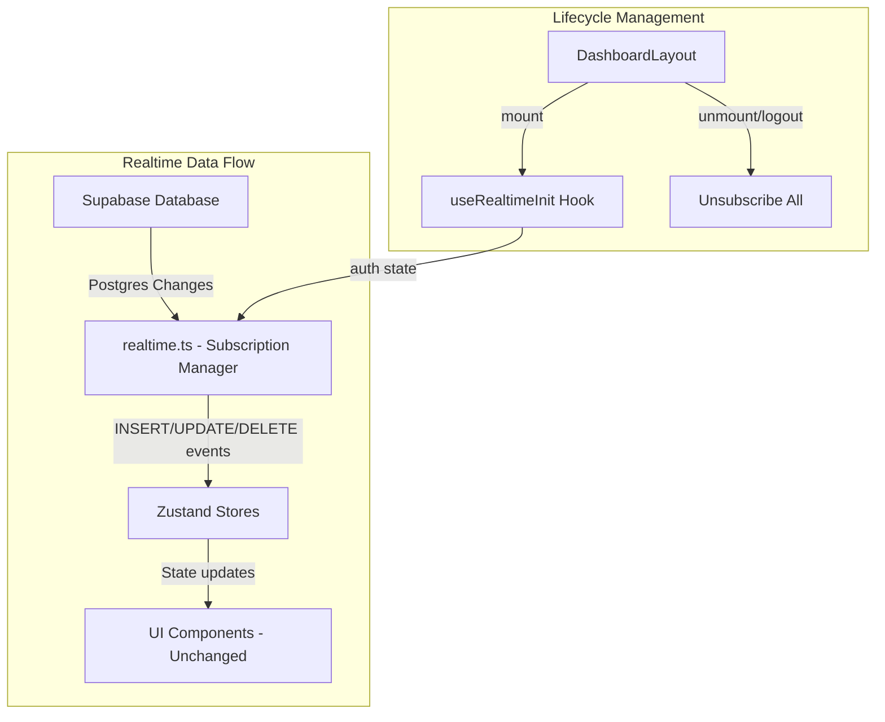
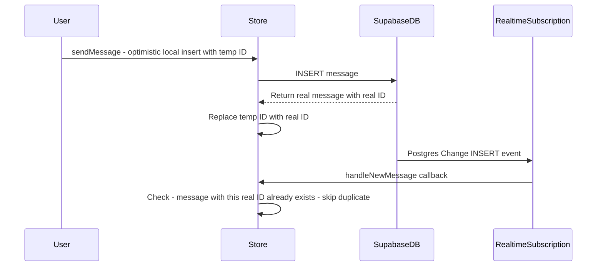

# Supabase Realtime Integration Plan

## Overview

Implement production-ready realtime functionality using Supabase realtime subscriptions. Live updates for messages, notifications, applications, and saved jobs — with clean channel management, proper cleanup, and premium UX preserved.

---

## Prerequisites

Before implementing realtime, the following must be enabled in the Supabase dashboard:

1. **Enable Realtime for each table** — Go to Database → Replication in Supabase dashboard and enable realtime for:
   - `messages` table
   - `notifications` table
   - `applications` table
   - `saved_jobs` table
   - `jobs` table (for provider job updates)

2. **The frontend integration plan must be completed first** — The realtime layer depends on:
   - Unified stores (Phase 3 of `supabase-frontend-integration.md`)
   - Data mappers (Phase 2 of `supabase-frontend-integration.md`)
   - Page integration (Phase 4 of `supabase-frontend-integration.md`)

   **Realtime subscriptions push data INTO stores. If stores still use mock data, realtime updates will conflict with hardcoded arrays.**

---

## Current State Analysis

### What Exists

| Component | Current State | Realtime Ready? |
|-----------|---------------|-----------------|
| [`supabaseClient.ts`](src/services/supabase/supabaseClient.ts) | Client initialized, `onAuthStateChange` helper exists | ✅ Client supports realtime |
| [`useMessagesStore.ts`](src/store/useMessagesStore.ts) | Fetch-only, no subscriptions | ❌ No realtime |
| [`useNotifications.ts`](src/store/useNotifications.ts) | Hardcoded `INITIAL_NOTIFICATIONS`, partial Supabase write | ❌ No realtime |
| [`useAppliedJobs.ts`](src/store/useAppliedJobs.ts) | Local-only `addAppliedJob`, partial Supabase load | ❌ No realtime |
| [`useSavedJobs.ts`](src/store/useSavedJobs.ts) | localStorage + partial Supabase sync | ❌ No realtime |
| [`ChatArea.tsx`](src/components/dashboard/ChatArea.tsx) | Local `useState` for messages, no store connection | ❌ No realtime |
| [`MessagesPage.tsx`](src/pages/dashboard/MessagesPage.tsx) | `MOCK_CONVERSATIONS` hardcoded | ❌ No realtime |
| [`NotificationDropdown.tsx`](src/components/dashboard/NotificationDropdown.tsx) | Reads from `useNotifications` store | ⚠️ Store needs realtime |
| [`DashboardLayout.tsx`](src/components/layout/DashboardLayout.tsx) | No data init, no subscription lifecycle | ❌ No realtime |
| [`useLiveStats.ts`](src/hooks/useLiveStats.ts) | Simulated with `setTimeout` | ❌ No realtime |

### Supabase Realtime API

Supabase uses Postgres Changes via channels:

```typescript
// Subscribe to INSERT events on a table
const channel = supabase
  .channel('custom-channel-name')
  .on(
    'postgres_changes',
    { event: 'INSERT', schema: 'public', table: 'messages', filter: `recipient_id=eq.${userId}` },
    (payload) => {
      // payload.new contains the new row
      // payload.old contains old row data (for UPDATE/DELETE)
    }
  )
  .subscribe()

// Cleanup
channel.unsubscribe()
```

---

## Target Architecture



### Data Flow Principle

**Supabase Postgres Change → realtime.ts event handler → Store action → Component re-render**

- `realtime.ts` manages channel creation and event routing
- Store actions handle incoming events — adding/updating/removing items
- Components react to store changes automatically via Zustand subscriptions
- No component directly manages Supabase channels

---

## Phase R1: Realtime Service Layer

**Goal**: Create reusable, modular subscription utilities in `src/services/supabase/realtime.ts`.

### New File: `src/services/supabase/realtime.ts`

This is the core realtime infrastructure module. It provides:

#### 1. Channel Factory Functions

Each domain gets a dedicated channel factory that creates a properly configured Supabase channel:

```typescript
// Channel factories
export function createMessagesChannel(userId: string, onInsert: (msg: Message) => void): RealtimeChannel
export function createNotificationsChannel(userId: string, onInsert: (notif: Notification) => void, onUpdate: (notif: Notification) => void): RealtimeChannel
export function createApplicationsChannel(userId: string, role: 'student' | 'provider', onInsert: (app: Application) => void, onUpdate: (app: Application) => void): RealtimeChannel
export function createSavedJobsChannel(studentId: string, onInsert: (saved: SavedJob) => void, onDelete: (saved: SavedJob) => void): RealtimeChannel
export function createJobsChannel(providerId: string, onInsert: (job: Job) => void, onUpdate: (job: Job) => void, onDelete: (jobId: string) => void): RealtimeChannel
```

#### 2. Subscription Manager

A centralized manager that tracks all active channels and provides bulk subscribe/unsubscribe:

```typescript
export class RealtimeSubscriptionManager {
  private channels: Map<string, RealtimeChannel>
  
  subscribe(channelId: string, channel: RealtimeChannel): void
  unsubscribe(channelId: string): void
  unsubscribeAll(): void
  isActive(channelId: string): boolean
}
```

#### 3. Event Type Definitions

Typed event payloads for each domain:

```typescript
export interface RealtimeEvent<T> {
  eventType: 'INSERT' | 'UPDATE' | 'DELETE'
  new: T
  old: Partial<T>
  table: string
  schema: string
}
```

#### 4. Filter Builders

Helper functions to construct Supabase realtime filters:

```typescript
export function buildUserFilter(userId: string): string  // e.g., `user_id=eq.${userId}`
export function buildRecipientFilter(userId: string): string  // for messages
export function buildProviderApplicantFilter(providerId: string): string  // for provider applications
```

### Design Principles for realtime.ts

- **No direct store imports** — realtime.ts receives callback functions, not store references. This keeps the service layer decoupled from state management per [`AI_RULES.md`](docs/AI_RULES.md:53) which mandates API calls reside in `/services`.
- **Channel naming convention** — `realtime:{domain}:{userId}` e.g., `realtime:messages:abc123`. This prevents channel collisions when multiple users share the same client.
- **Error resilience** — Each channel factory includes connection state monitoring. If Supabase realtime disconnects, channels auto-reconnect via Supabase's built-in retry mechanism.
- **Graceful degradation** — If `isSupabaseConfigured()` returns false, channel factories return null and subscription manager skips subscription. The app falls back to fetch-only mode.

---

## Phase R2: Realtime Messages

**Goal**: New messages appear instantly in chat without manual refresh.

### 2.1: Store Enhancement — `useMessagesStore.ts`

Add realtime subscription actions to the existing messages store:

```typescript
interface MessagesState {
  // ... existing fields ...
  
  // New realtime fields
  isSubscribed: boolean
  
  // New realtime actions
  subscribeToMessages: (userId: string) => void
  unsubscribeFromMessages: () => void
  handleNewMessage: (msg: Message) => void  // Called by realtime callback
  handleUpdatedMessage: (msg: Message) => void  // For read status updates
}
```

**`subscribeToMessages` implementation**:
- Calls `createMessagesChannel(userId, onInsertCallback, onUpdateCallback)` from realtime.ts
- `onInsertCallback` → calls `handleNewMessage` which adds message to `messages` array
- `onUpdateCallback` → calls `handleUpdatedMessage` which updates message in array (e.g., is_read change)
- Registers channel with `RealtimeSubscriptionManager`
- Sets `isSubscribed: true`

**`handleNewMessage` implementation**:
- If the new message belongs to the currently active conversation, append to `messages` array
- If it belongs to a different conversation, update `conversations` list to reflect new lastMessage
- This ensures the sidebar conversation list updates even when user is in a different chat

### 2.2: ChatArea Integration

[`ChatArea.tsx`](src/components/dashboard/ChatArea.tsx) currently uses local `useState` for messages. Changes needed:

- **After frontend integration plan is complete** (stores are connected to Supabase), ChatArea will read from `useMessages` store
- Realtime messages arrive via store subscription → ChatArea re-renders automatically
- The `handleSend` function should call `useMessages.sendMessage()` which does optimistic local insert + Supabase insert
- Auto-scroll behavior (already implemented via `bottomRef`) works unchanged

### 2.3: MessagesPage Integration

[`MessagesPage.tsx`](src/pages/dashboard/MessagesPage.tsx) currently uses `MOCK_CONVERSATIONS`. After frontend integration:

- Conversations list reads from `useMessages.conversations`
- Realtime INSERT on messages table updates the conversation sidebar instantly
- When a new message arrives for a different conversation, the sidebar shows updated `lastMessage` and `isUnread`

### 2.4: Message Read Status Realtime

When a recipient marks a message as read:

- Supabase UPDATE on `messages` table fires `UPDATE` event
- The sender's subscription catches this update
- Store updates the message's `is_read` field in the conversation list
- Unread count badges update automatically

---

## Phase R3: Realtime Notifications

**Goal**: Instant notification delivery, unread count updates, realtime dashboard activity.

### 3.1: Store Enhancement — `useNotifications.ts`

After the frontend integration plan merges `useNotificationsStore` into `useNotifications`, add realtime:

```typescript
interface NotificationsState {
  // ... existing fields ...
  
  // New realtime fields
  isSubscribed: boolean
  
  // New realtime actions
  subscribeToNotifications: (userId: string) => void
  unsubscribeFromNotifications: () => void
  handleNewNotification: (notif: Notification) => void
  handleUpdatedNotification: (notif: Notification) => void
}
```

**`subscribeToNotifications` implementation**:
- Calls `createNotificationsChannel(userId, onInsertCallback, onUpdateCallback)` from realtime.ts
- `onInsertCallback` → calls `handleNewNotification` which:
  - Maps the DB notification to `NotificationItem` via mapper
  - Prepends to `notifications` array
  - Unread count updates automatically (derived from array)
- `onUpdateCallback` → calls `handleUpdatedNotification` which:
  - Updates the notification in array (e.g., `is_read` change)
  - Used when `markNotificationAsRead` is called from another session/tab

### 3.2: NotificationDropdown Realtime

[`NotificationDropdown.tsx`](src/components/dashboard/NotificationDropdown.tsx) already reads from `useNotifications` store. After realtime integration:

- New notifications appear in the dropdown instantly without page refresh
- The unread badge on the bell icon updates in real-time
- `markAsRead` calls Supabase → UPDATE event fires → other tabs/sessions see the change

### 3.3: NotificationsPage Realtime

[`NotificationsPage.tsx`](src/pages/dashboard/NotificationsPage.tsx) already reads from `useNotifications` store. After realtime:

- New notifications appear at the top of the list instantly
- Status changes (read/unread) reflect immediately
- The "Mark all read" button updates all notifications via Supabase batch, and realtime propagates the changes

### 3.4: Notification Creation Triggers

When certain events happen in the app, notifications should be created for the relevant user:

| Event | Notification For | Type |
|-------|-----------------|------|
| Student applies to job | Provider (job.owner) | `new_applicant` |
| Provider updates application status | Student (applicant) | `application_viewed` / `offer_accepted` / `offer_rejected` |
| New message received | Recipient | `new_message` |
| Job posted nearby | Matching students | `job_alert` |

These notifications are created via `createNotificationInDb` in the mutation flows. The realtime subscription then delivers them instantly to the target user.

---

## Phase R4: Realtime Applications

**Goal**: Provider sees new applicants instantly; students see application status updates instantly.

### 4.1: Store Enhancement — `useAppliedJobs.ts`

After frontend integration merges `useApplications` into `useAppliedJobs`, add realtime:

```typescript
interface AppliedJobsState {
  // ... existing fields ...
  
  // New realtime fields
  isSubscribed: boolean
  
  // New realtime actions
  subscribeToApplications: (userId: string, role: 'student' | 'provider') => void
  unsubscribeFromApplications: () => void
  handleNewApplication: (app: Application) => void
  handleUpdatedApplication: (app: Application) => void
}
```

### 4.2: Student Subscription

For students, subscribe to applications where `student_id = userId`:

- **INSERT**: New application created → appears in student's "My Applications" pipeline instantly
- **UPDATE**: Application status changed → student sees `applied → viewed → accepted/rejected` transition in real-time

Filter: `student_id=eq.${userId}`

### 4.3: Provider Subscription

For providers, subscribe to applications for their jobs:

- **INSERT**: New applicant → appears in provider's "Applicants Queue" instantly
- **UPDATE**: Application status changed by provider → confirms the change was persisted

Filter approach: Since applications don't have a direct `provider_id` column, use a composite filter:
- Subscribe to ALL applications INSERT/UPDATE where the related job belongs to the provider
- Supabase realtime doesn't support JOIN filters, so we subscribe to applications broadly and filter in the callback:
  ```typescript
  // Subscribe to all application changes, filter in callback
  .on('postgres_changes', { event: '*', schema: 'public', table: 'applications' }, (payload) => {
    // Check if the application's job_id belongs to this provider
    // This requires checking against the provider's known job IDs
  })
  ```
- Alternative: Subscribe with no filter and validate in the handler against `useJobs.getState().jobs` to check if `job_id` belongs to the provider

### 4.4: Provider Dashboard Realtime

[`ProviderDashboardPage.tsx`](src/pages/dashboard/ProviderDashboardPage.tsx) will show:
- New applicants appearing in the queue without refresh
- Application count badges updating on `ActiveJobCard` components
- Status change confirmations after provider accepts/rejects

### 4.5: Student Jobs Page Realtime

[`JobsPage.tsx`](src/pages/dashboard/JobsPage.tsx) will show:
- Application status transitions (applied → viewed → accepted) happening live
- Tab counts updating without manual refresh

---

## Phase R5: Realtime Saved Jobs

**Goal**: Cross-dashboard saved state synchronization.

### 5.1: Store Enhancement — `useSavedJobs.ts`

```typescript
interface SavedJobsState {
  // ... existing fields ...
  
  // New realtime fields
  isSubscribed: boolean
  
  // New realtime actions
  subscribeToSavedJobs: (studentId: string) => void
  unsubscribeFromSavedJobs: () => void
  handleNewSavedJob: (saved: SavedJob) => void
  handleRemovedSavedJob: (savedId: string) => void
}
```

### 5.2: Subscription Design

Subscribe to `saved_jobs` table with filter `student_id=eq.${studentId}`:

- **INSERT**: Job saved from another session/tab → appears in saved list
- **DELETE**: Job unsaved from another session/tab → removed from saved list

This enables:
- Saving a job on the dashboard → it appears in the Saved Jobs page instantly
- Unsaving on the Saved Jobs page → bookmark icon updates on the dashboard JobCard instantly
- Cross-device sync — save on phone, see it on desktop

### 5.3: JobCard Bookmark Realtime

[`JobCard.tsx`](src/components/dashboard/JobCard.tsx) reads `isSaved` from `useSavedJobs` store. After realtime:
- When a saved job is removed via realtime DELETE event, `isSaved(job.id)` returns false → bookmark icon updates
- When a job is saved via realtime INSERT event, `isSaved(job.id)` returns true → bookmark fills

---

## Phase R6: Realtime Init Hook — Centralized Lifecycle

**Goal**: Manage all realtime subscriptions from a single point with proper cleanup.

### New File: `src/hooks/useRealtimeInit.ts`

```typescript
export const useRealtimeInit = () => {
  const { user, isAuthenticated, isRecovering } = useAuth()
  
  useEffect(() => {
    if (!isAuthenticated || !user || isRecovering) return
    if (!isSupabaseConfigured()) return
    
    // Subscribe to all realtime channels
    const userId = user.id
    const role = user.role
    
    // Messages
    useMessages.getState().subscribeToMessages(userId)
    
    // Notifications
    useNotifications.getState().subscribeToNotifications(userId)
    
    // Applications
    useAppliedJobs.getState().subscribeToApplications(userId, role)
    
    // Saved Jobs (students only)
    if (role === 'student') {
      useSavedJobs.getState().subscribeToSavedJobs(userId)
    }
    
    // Provider Jobs (providers only)
    if (role === 'provider') {
      useJobs.getState().subscribeToProviderJobs(userId)
    }
    
    // Cleanup on unmount or auth change
    return () => {
      realtimeManager.unsubscribeAll()
      useMessages.getState().unsubscribeFromMessages()
      useNotifications.getState().unsubscribeFromNotifications()
      useAppliedJobs.getState().unsubscribeFromApplications()
      if (role === 'student') useSavedJobs.getState().unsubscribeFromSavedJobs()
      if (role === 'provider') useJobs.getState().unsubscribeFromProviderJobs()
    }
  }, [isAuthenticated, user?.id, isRecovering])
}
```

### Integration Point: `DashboardLayout.tsx`

Add `useRealtimeInit()` call in [`DashboardLayout.tsx`](src/components/layout/DashboardLayout.tsx):

```typescript
export const DashboardLayout = () => {
  useRealtimeInit()  // <-- Add this line
  // ... rest unchanged ...
}
```

This ensures:
- Subscriptions start when user enters dashboard
- Subscriptions stop when user leaves dashboard or logs out
- No orphaned channels when navigating between pages

### Auth State Change Handling

When `useAuth` detects logout (via `onAuthStateChange`), all realtime subscriptions must be cleaned up:

- The `useRealtimeInit` effect cleanup function handles this
- When `isAuthenticated` becomes false, the effect re-runs and the cleanup from the previous run unsubscribes all channels
- The `RealtimeSubscriptionManager.unsubscribeAll()` method removes all channels from the Supabase client

---

## Phase R7: Performance & Cleanup

### 7.1: Subscription Lifecycle Rules

| Rule | Implementation |
|------|---------------|
| One channel per domain per user | Channel names include userId: `realtime:messages:${userId}` |
| No duplicate subscriptions | `isSubscribed` flag in each store prevents double-subscribe |
| Clean unsubscribe on logout | `useRealtimeInit` cleanup + `RealtimeSubscriptionManager.unsubscribeAll()` |
| Clean unsubscribe on page leave | Effect cleanup in `useRealtimeInit` handles unmount |
| Auto-reconnect on disconnect | Supabase client handles this automatically |

### 7.2: Preventing Excessive Rerenders

- **Zustand selectors**: Components must use `useStore(state => state.specificField)` not `useStore()` to subscribe to minimal state slices
- **Event deduplication**: If a realtime INSERT event arrives for a message that was already added via optimistic UI, the store handler checks for duplicate IDs before adding
- **Batched updates**: If multiple events arrive rapidly (e.g., 10 new notifications), Zustand's `set()` batches them into a single state update

### 7.3: Optimistic UI + Realtime Conflict Resolution

When a user performs a mutation (e.g., sends a message), the flow is:



Key rule: **Every store realtime handler must check for existing items before inserting** to avoid duplicates from optimistic UI + realtime echo.

### 7.4: Graceful Fallbacks

- If Supabase realtime is not enabled for a table, the channel subscription silently fails and the app continues with fetch-only mode
- If the realtime connection drops, Supabase auto-reconnects. During the disconnect gap, the app shows cached data
- If `isSupabaseConfigured()` returns false, no channels are created and the app works in offline/local mode
- Each store's `subscribe*` action checks `isSupabaseConfigured()` before creating channels

### 7.5: Memory Leak Prevention

- `useRealtimeInit` returns a cleanup function that unsubscribes all channels
- Each store's `unsubscribeFrom*` action removes the channel from `RealtimeSubscriptionManager` and calls `channel.unsubscribe()`
- On component unmount, React's effect cleanup guarantees subscription teardown
- `RealtimeSubscriptionManager` tracks all active channels and can bulk-unsubscribe

---

## Files to Create

| File | Purpose |
|------|---------|
| `src/services/supabase/realtime.ts` | Core realtime subscription service — channel factories, subscription manager, event types, filter builders |
| `src/hooks/useRealtimeInit.ts` | Centralized realtime subscription lifecycle hook |

## Files to Modify

| File | Changes |
|------|---------|
| `src/store/useMessagesStore.ts` | Add `subscribeToMessages`, `unsubscribeFromMessages`, `handleNewMessage`, `handleUpdatedMessage`, `isSubscribed` |
| `src/store/useNotifications.ts` | Add `subscribeToNotifications`, `unsubscribeFromNotifications`, `handleNewNotification`, `handleUpdatedNotification`, `isSubscribed` |
| `src/store/useAppliedJobs.ts` | Add `subscribeToApplications`, `unsubscribeFromApplications`, `handleNewApplication`, `handleUpdatedApplication`, `isSubscribed` |
| `src/store/useSavedJobs.ts` | Add `subscribeToSavedJobs`, `unsubscribeFromSavedJobs`, `handleNewSavedJob`, `handleRemovedSavedJob`, `isSubscribed` |
| `src/store/useJobs.ts` | Add `subscribeToProviderJobs`, `unsubscribeFromProviderJobs`, `handleNewJob`, `handleUpdatedJob`, `handleDeletedJob`, `isSubscribed` |
| `src/components/layout/DashboardLayout.tsx` | Add `useRealtimeInit()` call |
| `src/hooks/useLiveStats.ts` | Future: connect to realtime platform stats |

## Files NOT Modified (Locked)

Per [`AI_RULES.md`](docs/AI_RULES.md:5):

- All locked landing sections, layouts, routing, branding
- Component UI/UX — animations, visual design, styling unchanged
- `src/services/supabase/supabaseClient.ts` — client already supports realtime, no changes needed
- `src/services/supabase/db.ts` — CRUD operations unchanged, realtime is a separate layer
- `src/services/supabase/auth.ts` — auth flows unchanged

---

## Execution Order

Realtime phases must execute in this order:

1. **R1** must come first — realtime.ts provides the subscription infrastructure all stores depend on
2. **R2-R5** can execute in any order after R1 — each domain is independent
3. **R6** must come after R2-R5 — the init hook wires up all store subscriptions
4. **R7** is final verification after all realtime is wired

**IMPORTANT**: Realtime implementation depends on the frontend integration plan being completed first. Stores must be connected to Supabase (not using mock data) before realtime subscriptions can push data into them.

### Recommended Execution Sequence

```
Frontend Integration Plan (Phases 1-7) → Realtime Plan (Phases R1-R7)
```

If the frontend integration is not yet complete, realtime subscriptions will conflict with hardcoded mock data. The realtime plan should be implemented after stores are unified and pages are consuming store data.

---

## Supabase Dashboard Setup Checklist

Before realtime works, the user must:

- [ ] Go to Supabase Dashboard → Database → Replication
- [ ] Enable realtime for `messages` table
- [ ] Enable realtime for `notifications` table
- [ ] Enable realtime for `applications` table
- [ ] Enable realtime for `saved_jobs` table
- [ ] Enable realtime for `jobs` table
- [ ] Verify RLS policies allow authenticated users to read relevant rows
- [ ] Test realtime in Supabase SQL editor: `SELECT * FROM pg_replication_slots;`

---

## Architecture Diagram — Complete Realtime Flow

```mermaid
graph TD
    subgraph Supabase
        DB[Postgres Database]
        RT[Realtime Engine]
        DB -->|Postgres Changes| RT
    end

    subgraph Service Layer
        RTS[realtime.ts]
        SM[SubscriptionManager]
        RTS --> SM
    end

    subgraph Store Layer
        MS[useMessages - subscribeToMessages]
        NS[useNotifications - subscribeToNotifications]
        AS[useAppliedJobs - subscribeToApplications]
        SS[useSavedJobs - subscribeToSavedJobs]
        JS[useJobs - subscribeToProviderJobs]
    end

    subgraph Init Layer
        RI[useRealtimeInit Hook]
        DL[DashboardLayout]
        DL --> RI
        RI --> MS
        RI --> NS
        RI --> AS
        RI --> SS
        RI --> JS
    end

    subgraph UI Layer - Unchanged
        CA[ChatArea]
        ND[NotificationDropdown]
        PD[ProviderDashboard]
        SP[SavedJobsPage]
        JC[JobCard Bookmark]
    end

    RT -->|postgres_changes events| RTS
    RTS -->|callback: handleNewMessage| MS
    RTS -->|callback: handleNewNotification| NS
    RTS -->|callback: handleNewApplication| AS
    RTS -->|callback: handleNewSavedJob| SS
    RTS -->|callback: handleNewJob| JS

    MS -->|state update| CA
    NS -->|state update| ND
    AS -->|state update| PD
    SS -->|state update| SP
    SS -->|state update| JC
    JS -->|state update| PD